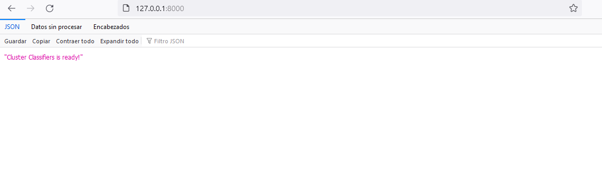
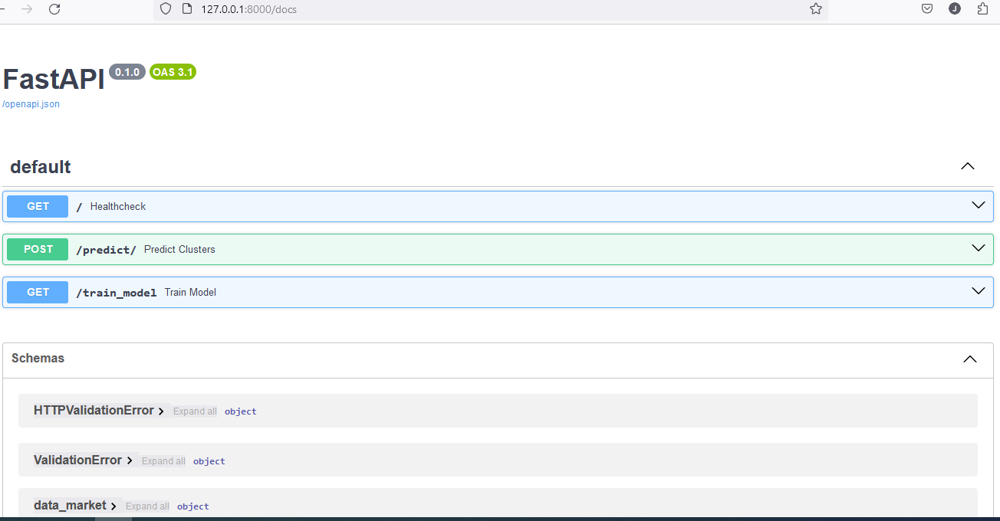
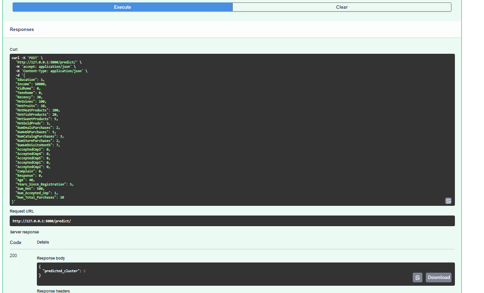
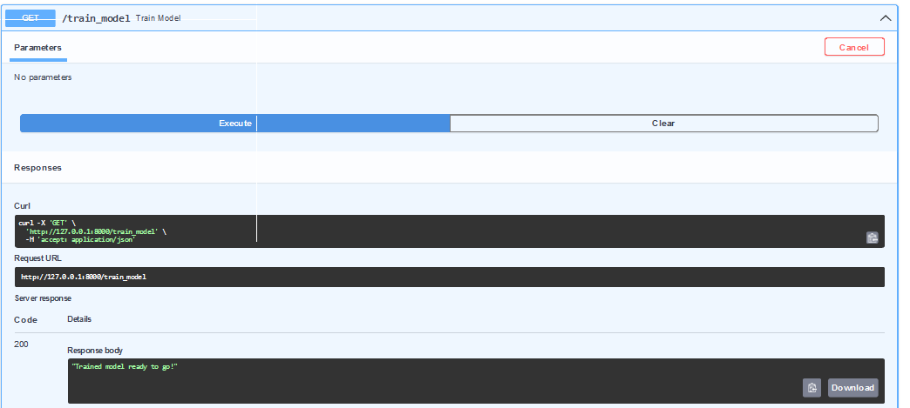
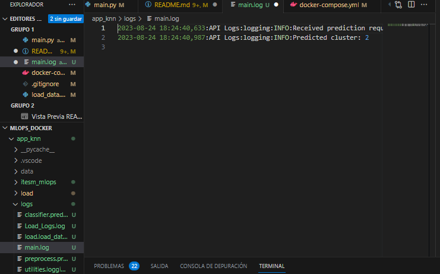

# ITESM Instituto Tecnológico de Estudios Superiores de Monterrey

## Course: MLOps Machine Learning Operations

### Teacher: Carlos Mejia

### Student: Juan Pablo Chavez Sainz


# Customer Personality Analysis

# Final Proyect

This repository contains the code and resources required to implement a customer personality analysis and clustering system using MLOps techniques. The primary goal of the project is to apply processes and best practices for managing the development, testing, and deployment workflow of machine learning models.

## Kaggle link

<https://www.kaggle.com/datasets/imakash3011/customer-personality-analysis>

### **Problem Statement**

Customer personality analysis helps a business to modify its product based on its target customers from different types of customer segments. For example, instead of spending money to market a new product to every customer in the company’s database, a company can analyze which customer segment is most likely to buy the product and then market the product only on that particular segment.

**Target** is: to perform clustering to summarize customer segments.

**2. What solutions (notebooks) have you already developed?**

There are already many notebooks created around this problem. Some are exploring new ways of clustering and others are dedicated to further understanding the problem.

This time I will take the following notebooks as a base:

    https://www.kaggle.com/code/gaganmaahi224/9-clustering-techniques-for-customer-segmentation#Evaluating-models

    https://www.kaggle.com/code/kslarwtf/eda-clustering-updated

    https://www.kaggle.com/code/alisultanov/clustering-customer-personality-analysis#Features:

**3. Which of all the solutions contains the minimum necessary to be able to train and save a model?**

        https://www.kaggle.com/code/gaganmaahi224/9-clustering-techniques-for-customer-segmentation#Evaluating-models

**4. Define the objective of the project, in this case it is only for the subject and it is a proof of concept.**

The objective of this project is to use all the MLOps tools seen in the course to:

    1. Deploy a tool that can identify the Customer segment.
    2. Deploy a tool that can do training on a new dataset.

**5. What models can be trained beyond the solution already created in Kaggle?**

There are already so many solutions in Kaggle, it is difficult to find which ones have not been used. What is certain is that for this exercise we will limit ourselves to not using excessively complex solutions, to facilitate the deployment and achieve adequate times in execution and according to the program.

**6. What will be the end result of this project?**

A tool (API) that can do training on a new dataset and identify the Customer segment for one person.


# Setup 

## Virtual environment

1. Create a virtual environment with `Python 3.10+`
    * Create venv

        ```bash
        python3.10 -m venv venv-tests
        ```

    * Activate the virtual environment

        ```
        for linux: 
        source venv-tests/bin/activate
        
        for windows: 
        ..\.venv\Scripts\activate
        ```

    * Install the packages

        ```bash
        pip install -r requirements-310.txt

        pip install -r requirements-dev.txt
        
        pip install -r requirements-api.txt
        ```

    > **NOTE:**
    Deactivate the virtual environment using this command at the end of its example.  

        deactivate

**The configuration is ready for the check the script!**

### Testing Data Processing and Analysis

This repository contains a set of test scripts for verifying the correctness of data processing and analysis functions using the Python programming language. These tests ensure that the implemented functions behave as expected and produce the desired outcomes. The tests are organized into separate files for each specific area of functionality.

Test Scripts

The repository includes the following test scripts:

    1. *test_data_existence.py*

This script tests the existence and validity of the input data. It checks whether the required datasets or files are present and properly formatted.

    2.*test_feature_generation.py*: 

This script tests the feature generation function. It ensures that the new features generated are correct and meet the intended specifications.

    3. *test_model_existence.py*: 

This script tests the existence of trained models. It verifies whether the saved models exist in the designated directory and can be loaded successfully.

    4. *test_remove_outliers.py*:     
This script tests the outlier removal function. It validates whether the outliers are properly identified and removed, resulting in a clean dataset.

## Pre-commits

Pre-commits are automated checks that run on your code before you commit changes, helping ensure code quality and consistency. In this guide, we'll use the pre-commit tool to set up pre-commits for Python projects in Visual Studio Code (VSC).

### Step 1: Install pre-commit 

First, you need to install the pre-commit tool on your system. Open your terminal or command prompt and run the following command:

    pip install pre-commit

### Step 2: Initialize Pre-Commit for Your Project

After reviewing the .pre-commit-config.yaml file, to look for hooks configured initialize pre-commit for the project. Open your terminal or command prompt, navigate to the root directory of your project, and run the following commands:

        pre-commit install


## Running the Tests

To run the tests, follow these steps:

Make sure you have Python installed on your system.

Install the required dependencies using the following command:

```
    pip install -r requirements-310.txt
    pip install -r requirements-api.txt
    pip install -r requirements-dev.txt

```

Run the desired test script using the following command:

    python test_script_name.py

*Replace test_script_name.py with the actual name of the test script you want to run (e.g., test_data_existence.py).*

The test script will execute and provide output indicating whether the tests have passed or failed.

## Test API

1. Change to root directory.

2. Run uvicorn app.main:app --reload in the terminal.

## Checking endpoints

1. Access http://127.0.0.1:8000/, you will see a message like this "CLuster Classifier is all ready to go!"



2. Access http://127.0.0.1:8000/docs, the browser will display something like this:



3. Try running the classify endpoint by providing some data:

Body: 

``` json
    {
    "Education": 1,
    "Income": 50000,
    "Kidhome": 0,
    "Teenhome": 0,
    "Recency": 30,
    "MntWines": 100,
    "MntFruits": 10,
    "MntMeatProducts": 200,
    "MntFishProducts": 20,
    "MntSweetProducts": 5,
    "MntGoldProds": 3,
    "NumDealsPurchases": 2,
    "NumWebPurchases": 5,
    "NumCatalogPurchases": 3,
    "NumStorePurchases": 2,
    "NumWebVisitsMonth": 7,
    "AcceptedCmp3": 0,
    "AcceptedCmp4": 0,
    "AcceptedCmp5": 0,
    "AcceptedCmp1": 0,
    "AcceptedCmp2": 0,
    "Complain": 0,
    "Response": 0,
    "Age": 40,
    "Years_Since_Registration": 5,
    "Sum_Mnt": 500,
    "Num_Accepted_Cmp": 1,
    "Num_Total_Purchases": 10
    }
```



4. Running the Train endpoint:



**Well done!!**

## Logging

We've established a class designed for simplified implementation of logging: the Logging CLASS.

Within this class, there exists an initialization method that accepts three parameters: name, level, and module name. The 'name' parameter is utilized to generate a logger with the designated name. The 'level' parameter determines the logging level of the logger, with the default being logging.DEBUG. As for the module name, it is employed to specify the name of the log file, with the default set to 'logs/name.log'.

Furthermore, the init method creates both a formatter, with a predefined format string, and a file handler using the specified module name. The formatter is then linked to the file handler, which subsequently becomes an addition to the logger.

This class is equipped with five distinct methods: debug, info, warning, error, and critical. Each method corresponds to a specific logging level and is responsible for recording messages accordingly.

### **To use the class:**

```
    import logging 
    from app.utilities.logging import MyLogger
    

    # to instanciate the logging class
    logfile = MyLogger("RetrieveFiles", logging.DEBUG, __name)
```


### Deployment of the API with Docker and usage

You are in the MLOPS_DOCKER/ directory (root folder), ensure you are in root. Then Run:

    ```
    docker build -t fraud-image ./app_knn/
    ```
